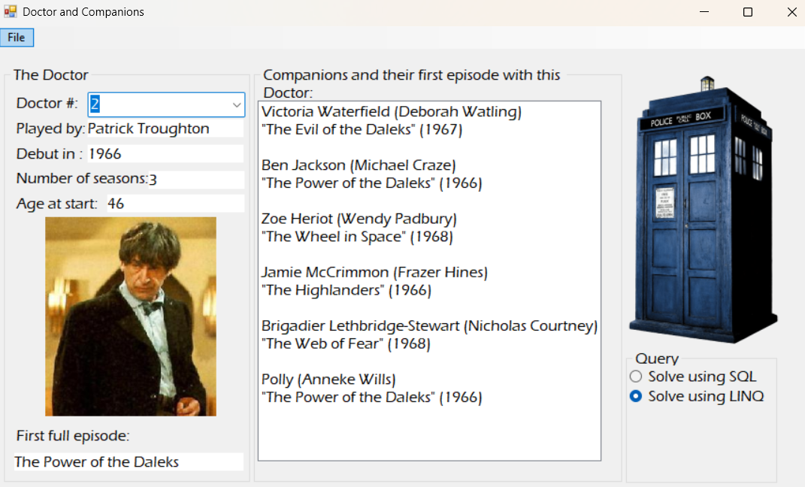

# Doctor Who Database

A Windows Forms desktop application built in C# that connects to a SQL Server database to display and explore relational Doctor Who data across three interconnected tables: **Doctor**, **Companion**, and **Episode**.

## Features

- Select any Doctor from a dropdown to instantly load their details — actor, debut year, number of seasons, and age at start
- View all companions associated with the selected Doctor, along with their first episode appearance
- Toggle between **SQL** and **LINQ** query modes to retrieve companion data, demonstrating two approaches to the same result
- Dynamic UI components (ComboBox, ListBox) that update based on database queries and user selections

## Tech Stack

| Technology | Purpose |
|---|---|
| C# | Application logic |
| Windows Forms | Desktop UI |
| SQL Server | Relational database |
| LINQ | In-memory query alternative to SQL |
| ADO.NET | Database connectivity |

## How to Run

1. Clone the repository
2. Open `lab5b.sln` in Visual Studio
3. Restore the database using the provided SQL script (attach to SQL Server Management Studio)
4. Update the connection string in `App.config` to point to your local SQL Server instance
5. Build and run the solution

## Database Schema

Three related tables:
- **Doctor** — stores each Doctor's number, actor name, debut year, seasons, and starting age
- **Companion** — stores companion name, actor name, and associated Doctor number
- **Episode** — stores episode title, year, and links companions to their first appearance

## What I Learned

- Designing and querying a normalized relational database with foreign key relationships
- Writing JOIN queries in both raw SQL and LINQ to retrieve the same data two ways
- Building a responsive Windows Forms UI where controls populate dynamically based on user input
- Connecting a C# application to SQL Server using ADO.NET

---

*Academic project — Mohawk College, Computer Systems Technology*
